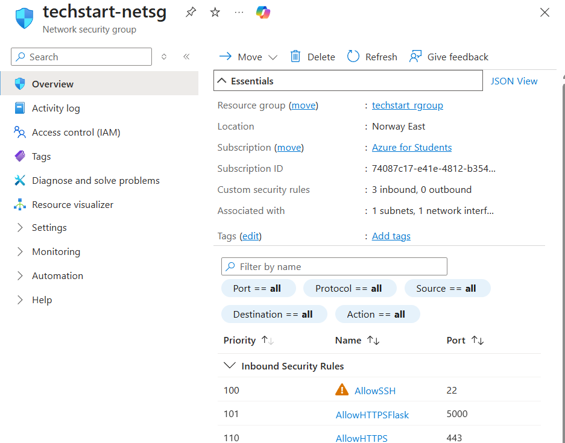
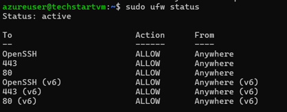
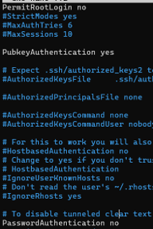
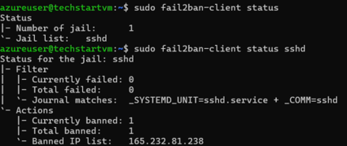
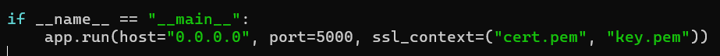
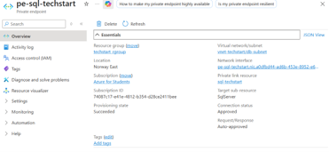
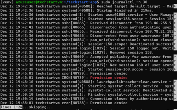
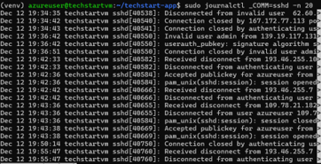

# Azure Secure Cloud Application

A cloud security project built on Microsoft Azure to design, deploy, and secure a web application using a defence-in-depth approach.

The environment combined an Ubuntu Linux virtual machine, Flask web application, Azure SQL Database, virtual networking, and multiple security controls across the network, operating system, database, and application layers.

**Technologies:** Microsoft Azure, Ubuntu Linux, Flask, Azure SQL, Network Security Groups, UFW, Fail2Ban, SSH, TLS/HTTPS, Bash, Azure RBAC, Private Endpoints, systemd-journald, rsyslog

## Project Overview

The project was based around a fictional company scenario called **Techstart Solutions**.

The goal was to build a cloud-hosted web application in Azure and then secure the environment using layered controls rather than relying on a single security mechanism.

The main components included:

- Ubuntu Linux virtual machine
- Flask web application
- Azure SQL Database
- Azure Virtual Network
- Segmented subnets
- Network Security Groups
- Private endpoints
- Azure RBAC

## Security Controls Implemented

### Network Security Groups

Azure Network Security Groups were configured to restrict inbound traffic to required services only.

Allowed ports included:

- SSH — port 22
- HTTPS — port 443
- Flask development access — port 5000

All unnecessary inbound traffic was denied.

### UFW Firewall

A host-based UFW firewall was configured on the Ubuntu virtual machine.

A default-deny approach was used, with only required ports explicitly allowed.

This provided an additional layer of protection alongside Azure NSGs.

### SSH Hardening

Password-based SSH authentication was disabled and replaced with key-based authentication.

This reduced exposure to password-based brute-force and credential attacks.

### Fail2Ban

Fail2Ban was installed and configured to monitor authentication logs and automatically ban IP addresses exceeding a threshold of failed SSH login attempts.

This added host-based protection against automated brute-force attacks.

### HTTPS and TLS

A self-signed TLS certificate was generated and configured within the Flask application.

HTTPS was enabled to protect login credentials and application traffic in transit.

### Azure SQL Security

Azure SQL Database was used to store application data.

Security controls included:

- Transparent Data Encryption
- Separate administrative and application accounts
- Limited permissions for application users
- Private endpoint access
- Restricted public exposure

### Private Endpoints

Private endpoints were configured for services such as Azure SQL Database and Azure Blob Storage.

This reduced the externally exposed attack surface and kept access within the internal virtual network.

### Logging and Monitoring

Linux logging was configured using:

- `systemd-journald`
- `rsyslog`

These were used to capture authentication events, service activity, and other security-relevant logs.

### Automated Backups

A Bash script was created to automate backups of web application files.

The backup process archived important directories and stored timestamped copies for recovery in the event of accidental deletion, misconfiguration, or security compromise.

### Automatic Security Updates

Automatic security updates were enabled to reduce exposure to known vulnerabilities and improve system patching.

### Access Control

A layered access-control model was implemented using:

- Azure Role-Based Access Control
- Linux permissions
- SSH key authentication
- SQL account separation
- Network restrictions

The principle of least privilege was used throughout the environment.

## Architecture

The application was deployed inside an Azure Virtual Network using segmented resources and controlled communication between the virtual machine, database, and other services.

The design aimed to reduce the attack surface while maintaining secure communication between components.

## Key Security Concepts Demonstrated

- Defence in depth
- Least privilege
- Network segmentation
- Host hardening
- Cloud access control
- Encryption in transit
- Encryption at rest
- Secure remote administration
- Logging and monitoring
- Brute-force protection
- Private networking
- Backup and recovery

## Challenges

Some of the main challenges involved:

- Configuring private endpoints without breaking database connectivity
- Troubleshooting communication between the VM and Azure SQL
- Opening only the required firewall ports
- Understanding self-signed certificate warnings
- Balancing application accessibility with security restrictions

These issues were resolved through testing, firewall configuration, DNS checks, and verification of virtual network settings.

## Technologies Used

- Microsoft Azure
- Ubuntu Linux
- Flask
- Azure SQL Database
- Network Security Groups
- UFW
- Fail2Ban
- Bash
- SSH
- TLS / HTTPS
- Azure RBAC
- Azure Private Endpoints
- systemd-journald
- rsyslog

## Project Documentation

The full project report is available in the [Docs directory](Docs/Report_Azure_Secure_Cloud_App_Sean_Wogan.pdf).

Additional screenshots of the Azure environment and implemented security controls are available in the `screenshots` directory.

## What I Learned

This project provided hands-on experience with:

- Securing cloud infrastructure
- Configuring layered security controls
- Managing Linux systems in Azure
- Applying least-privilege access
- Troubleshooting cloud networking
- Implementing host and network firewalls
- Securing remote administration
- Protecting data at rest and in transit
